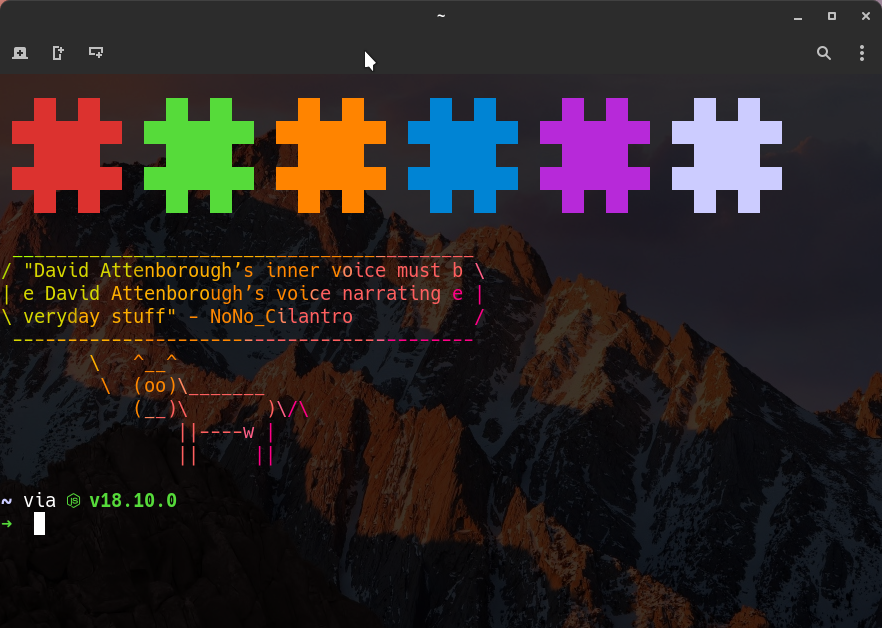

# ~/.dotfiles
My (highly opinionated) dotfiles and collection of various shell scripts.

## [NYI] Installation

```sh
# linux, macos:
curl -sSf https://raw.githubusercontent.com/archelaus/dotfiles/master/install.sh | sh
```

## Packages I use

| package name | what it do |
| - | - |
[fish](https://fishshell.com/) | friendly interactive shell
[mpv](https://github.com/mpv-player/mpv) | command line video player
[yt-dlp](https://github.com/yt-dlp/yt-dlp) | youtube-dl fork with additional features and fixes
[yt-fzf](https://github.com/pystardust/ytfzf) | find and watch youtube videos from the terminal	
[vim](https://www.vim.org/) | text editor

## Philosophy
- Split things into multiple files whenever possible
- Minimalism
- UNIX-y, every tool does its own thing well
- No unnecessary fluff or visual effects
- Focus on maximising productivity
- Keep the home directory as clean as possible (XDG-compliance)

## [NYI] The all important obligatory screenshot



## License

This project is licensed under the
[MIT](https://en.wikipedia.org/wiki/MIT_License) license.

See LICENSE for more details.
